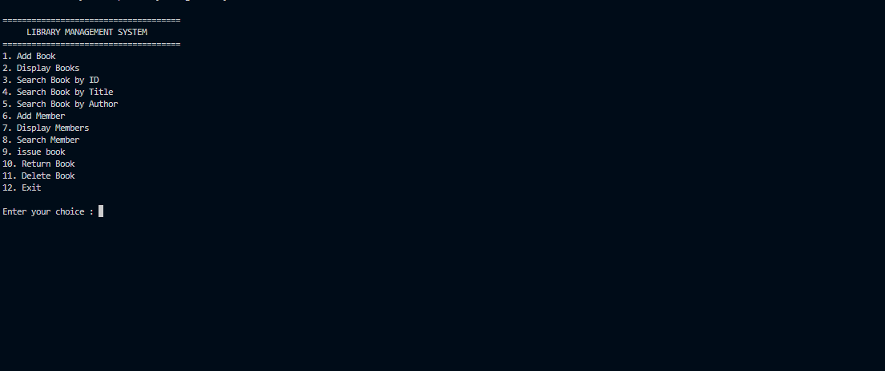
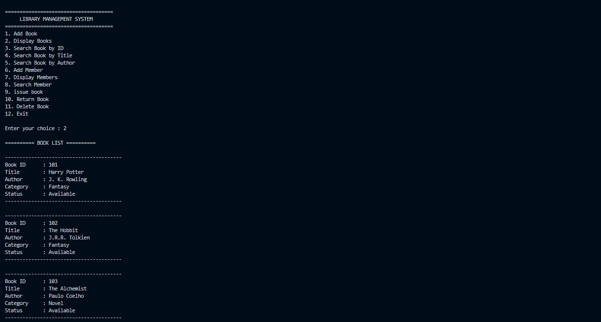
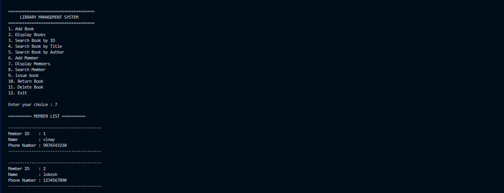
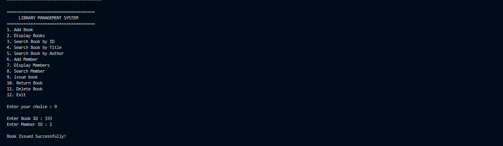

# 📚 Library Management System

A console-based **Library Management System** developed in **C++** using **Object-Oriented Programming (OOP)** and **File Handling**. The application enables efficient management of books, members, and borrowing records while demonstrating core C++ programming concepts.

---


---

## 📌 Project Overview

This project simulates a real-world library management system through a menu-driven console application. It allows users to manage books, library members, issue and return books, and search records efficiently. All information is stored using text files, ensuring data persistence even after the program exits.

Developed as part of the **Thiranex C++ Internship Program**, this project strengthened concepts such as object-oriented programming, file handling, vectors, string streams, and CRUD operations.

---

## 📑 Table of Contents

- 📌 Project Overview
- ✨ Features
- 🛠 Technologies Used
- 📂 Project Structure
- ⚙️ How It Works
- 🚀 Getting Started
- 📸 Screenshots
- 📖 Concepts Demonstrated
- 🎯 Future Improvements
- 📚 What I Learned
- 📊 Project Status
- 👨‍💻 Author

---

## ✨ Features

- ✅ Add Book
- ✅ Display Books
- ✅ Search Book by ID
- ✅ Search Book by Title
- ✅ Search Book by Author
- ✅ Add Member
- ✅ Display Members
- ✅ Search Member
- ✅ Issue Book
- ✅ Return Book
- ✅ Delete Book
- ✅ Persistent File Storage

---

## 🛠 Technologies Used

| Technology | Purpose |
|------------|---------|
| C++ | Programming Language |
| OOP | Data Management |
| File Handling | Persistent Storage |
| STL Vector | Temporary Data Storage |
| StringStream | Parsing Records |
| VS Code | Development Environment |
| GCC (MSYS2 MinGW) | Compiler |
| Git & GitHub | Version Control |

---

## 📂 Project Structure

```text
Library-Management-System/
│
├── screenshots/
│   ├── home.png
│   ├── books.png
│   ├── members.png
│   └── transactions.png
│
├── books.txt
├── members.txt
├── issued_books.txt
├── main.cpp
├── .gitignore
├── LICENSE
└── README.md
```

---

## ⚙️ How It Works

Each book contains:

- Book ID
- Title
- Author
- Category
- Issue Status

Each member contains:

- Member ID
- Member Name
- Phone Number

Books are stored in:

```text
books.txt
```

Members are stored in:

```text
members.txt
```

Borrowing records are maintained in:

```text
issued_books.txt
```

using pipe-separated records.

Example:

```text
101|Harry Potter|J. K. Rowling|Fantasy|0
```

---

## 🚀 Getting Started

### Clone Repository

```bash
git clone https://github.com/karrivinay54/Library-Management-System.git
```

### Navigate

```bash
cd Library-Management-System
```

### Compile

```bash
g++ main.cpp -o main
```

### Run

Windows

```bash
./main.exe
```

Linux/macOS

```bash
./main
```

---

## 📸 Screenshots

### 🏠 Main Menu



---

### 📚 Book Management



---

### 👥 Member Management



---

### 🔄 Book Transactions



---

## 📖 Concepts Demonstrated

- Object-Oriented Programming
- Classes and Objects
- Constructors
- File Handling
- CRUD Operations
- Searching Algorithms
- Vectors
- String Streams
- Menu-driven Programming
- Data Persistence

---

## 🎯 Future Improvements

- Login Authentication
- Due Date Management
- Fine Calculation
- ISBN Validation
- Book Reservation
- Binary File Storage
- GUI using Qt
- Database Integration using MySQL

---

## 📚 What I Learned

During this project I gained practical experience with:

- Designing menu-driven applications
- Managing books and members using classes
- Reading and writing structured text files
- Parsing records using stringstream
- Implementing issue and return logic
- Applying CRUD operations in C++
- Version control using Git and GitHub

---

## 📊 Project Status

- ✅ Status: Completed
- 🏷 Version: v1.0.0
- 💻 Language: C++
- 🧩 Paradigm: Object-Oriented Programming
- 💾 Storage: Text Files
- 📅 Last Updated: July 2026

---

## 👨‍💻 Author

**Karri Vinay**

B.Tech – Electronics & Communication Engineering

RGUKT IIIT Nuzvid

🔗 GitHub: https://github.com/karrivinay54

💼 LinkedIn:

(https://www.linkedin.com/in/vinay-karri-53071b288/)

---

## ⭐ If you found this project helpful

Consider giving this repository a ⭐ on GitHub.
